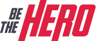

<h4 align="center">
 
 <b>Seja um verdadeiro Heroi!</b> 🦸‍♂️
</h4>

  
  

 

### :rocket: Be The Hero - Projeto semana omnistack 11.0
Para o desenvolvimento deste projeto foram utilizadas as seguintes tecnologias:

- [Node.js](https://nodejs.org/en/)
- [React](https://reactjs.org/)
- [Reactnative](https://reactnative.dev/)
- [Expo](https://expo.io/)
- [Express](https://expressjs.com/pt-br/)
- [ExpressJs](https://expressjs.com/pt-br/)
- [Nodemon](https://www.npmjs.com/package/nodemon)
- [Axios](https://www.npmjs.com/package/axios)
- [Cors](https://www.npmjs.com/package/cors)
- [Jest](https://www.npmjs.com/package/jest)

### :muscle: Projeto

Aplicação de doações para ONGs. O backend foi desenvolvido em Node, o frontend em React e o mobile em ReactNative. Pode cadastrar os casos que necessitam de doações, e pode doar para os casos.

Escolha um dos casos e seja o herói do dia :)

### :memo: Licença

Esse projeto está sob a licença MIT. Veja o arquivo [LICENSE](LICENSE.md) para mais detalhes.

---

Feito  por <strong>Adriano Almeida
